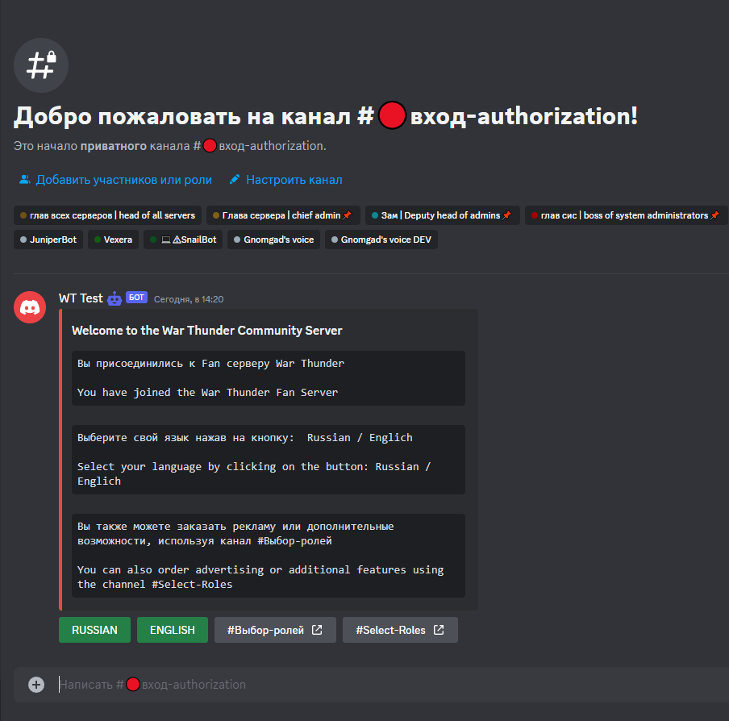
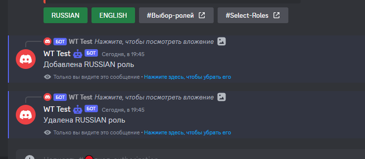
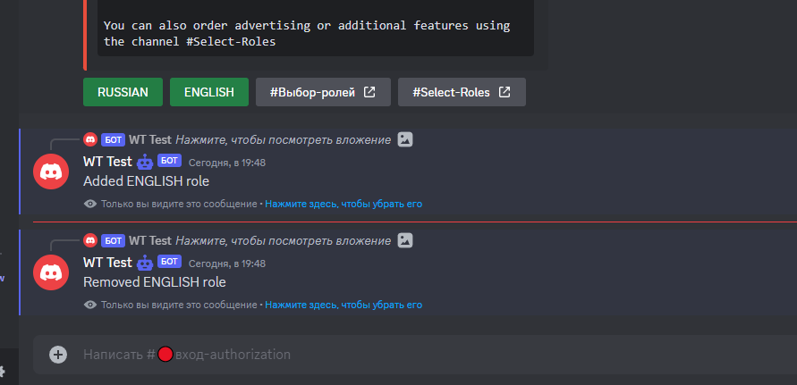
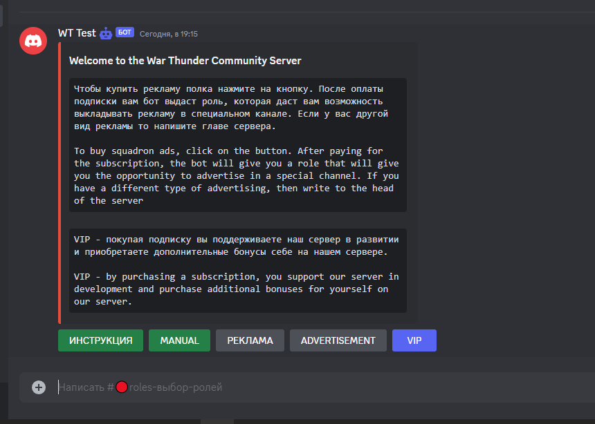
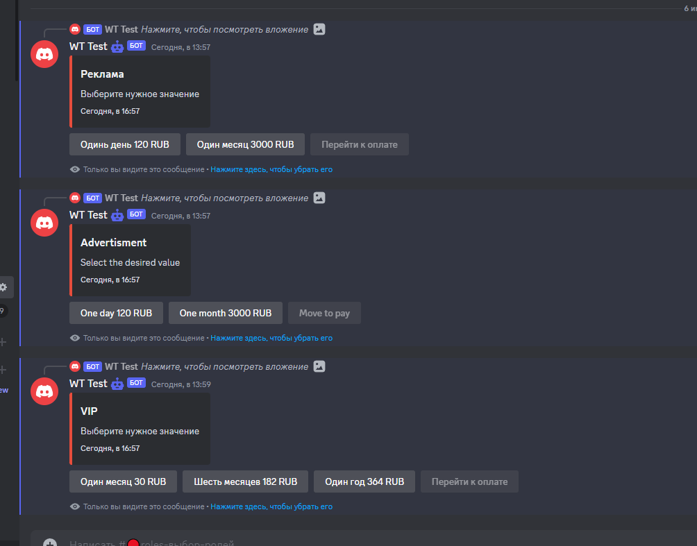
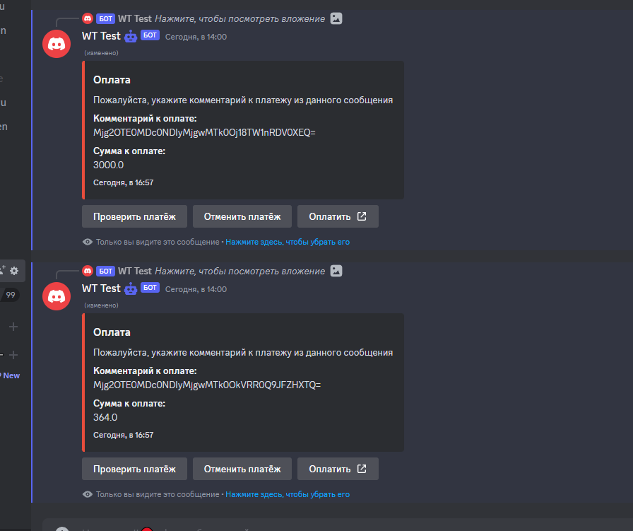

# Просто предисловие

В общем и целом можно менять всё и вся, не особо смотри на примеры, я был бы рад тому, что предоставишь ты, как человек, работающий с дизайном. ЛЛюбые предложение и пожелания всегда приветсвуются.

# Оформление авторизации (сообщение + кнопки) (канал)

## Примерный неоформленный вариант главного сообщения 

Требуется оформить сообщение, учитывая стилистику сервера и примерный вариант.
Предпочитаемый вариант готового решения: json с сайта [discohook](https://discohook.org/) с описанием того, что должно происходить с течением времени(если требуется) или по нажатиям на кнопки/выпадающие меню.
Приветсвуются дополнительные вопросы на счёт данного документа, и требований в общем. Также приветсвуются изменения структуры сообщения, к примеру: добавления выпадающих меню, добавление всплывающих окон, замена текста и другое.

## Кнопка RUSSIAN [^1]

Выдаёт роль *russian, ответное сообщение:

Требуется оформить сообщение, учитывая стилистику сервера.
Предпочитаемый вариант готового решения: json с сайта [discohook](https://discohook.org/) с ответным сообщением.
Приветсвуются дополнительные вопросы на счёт данного документа, и требований в общем.

## Кнопка ENGLISH [^2]

Выдаёт роль *english, ответное сообщение:

Требуется оформить сообщение, учитывая стилистику сервера.
Предпочитаемый вариант готового решения: json с сайта [discohook](https://discohook.org/) с ответным сообщением.
Приветсвуются дополнительные вопросы на счёт данного документа, и требований в общем.

## Кнопки-ссылки #Выбор-ролей, #Select-Roles

Данная кнопка не имеет interaction, является обычной заглушкой(невозможно обработать нажатие). Ведёт в канал c выбором ролей.
Приветсвуются предложения по формлению данных кнопок и каналов, к которым они ведут.

# Оформление покупки ролей (серия сообщений + кнопки) (канал)

## Главное сообщение (висит постоянно)

## Кнопки ИНСТРУКЦИЯ, MANUAL

Требуется разработка ответных сообщений с 0, предполагаю, что делать это лучше вместе(для составления инструкции и записи обучающих мини видео).

## Кнопки РЕКЛАМА, ADVERTISEMENT, VIP

Требуется оформление выбора значений с кратким объяснением ...

## Кнопки оформления заказа

Требуется оформление оплаты с кратким объяснением ...

Требуется оформление уведомления об ошибке с кратким объяснением...
Требуется оформление уведомления об успехе с кратким объяснением...

# Оформление выбора ролей (сообщение)

С нуля разработать embed сообщения для выбора ролей с описанием
adver - роль, позволяющая создавать рекламу через бота
vip - роль, дающая дополнительные возможности на сервере

# Чисто дополнение от меня (yunikeil)

Был бы рад помощи в оформлении сервера в общем, как я уже и говорил, с дизайном у меня большие проблемы(как с ui так и с ux), а в планах поменять структуру голосовых, перебрать роли, нормально организовать рекламу, и избавиться от (лишних && внешних) ботов, оставив некоторые из музыкальных и возможно каких-либо ещё. Мне бы помогла помощь не только с основным дизайном но и с планированием работы ботов(UX).
Буду благодарен любой поддержке.

[^1]: ID роли: 00000000000
[^1]: ID роли: 00000000000
